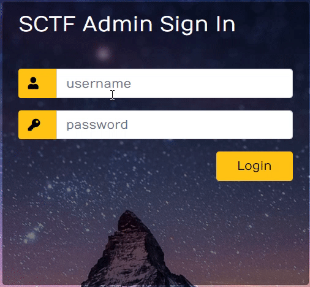
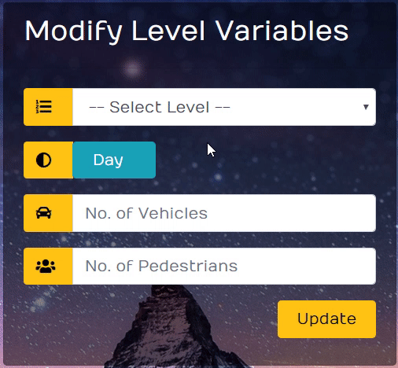

# Team15

# RideSafe

RideSafe is a VR application that simulates safe cycling and usage of PMDs in Singapore. By going through the various simulations available in the RideSafe VR application, cyclists and PMD usersshouldbe able tounderstand the ways of safe cycling. Similarly, pedestrians and vehicle driverscan also use  RideSafe to empathize from the cyclists and PMD users’ point of view. Ultimately, the intended outcome is for the average number of accidents, that can be prevented with simple safety measures, to be  reduced.  It  is  to  be  noted,  however,  that  RideSafe  does  not  teach  an  individual  how  to  operate  a bicycle or PMD, nor pre-cycling or pre-riding safety measures such as strapping on a helmet and check of brakes et cetera.

## Installation

- All the `code` required to get started
- Images, and models that are required for the application

### Clone

- Clone this repo to your local machine using `https://github.com/fvcproductions/SOMEREPO`

## Getting Started

These instructions will get you a copy of the project up and running on your local machine.

### Prerequisites

These are the software you need to run this prototype

`Git`
`Python`

### How to install

A step by step series of instructions that tell you how to get the prototype running

Downloading the project files into in an Existing Directory

for Linux:
`$ cd /home/user/my_project`

for Mac:
`$ cd /Users/user/my_project`

for Windows:
`$ cd /c/user/my_project`

and type:
`$ git clone https://github.com/tqx2012/Team15.git`

### How to Run

Change your current directory into the project directory.

Using our link hosted on Github pages: https://tqx2012.github.io/Team15/  ( No installation needed)

Run `python -m SimpleHTTPServer` (or `python -m http.server` for Python 3) in a terminal in the same directory as your HTML file.

Visit `localhost:8000` and you will see the VR environment loaded up in the browser.

Google Cardboard provides the best experience for RideSafe

## How do players interact with VR environment

1. When selecting levels, players can stare at the levels to enter the respective levels to play in 
2. Within the game itself, there will be yellow cylinders as checkpoints. Players can stare at the cylinders to proceed. Read the messages inside the game and follow instructions to proceed.

## How does an admin interact with the portal
Log in  

Modify!  

